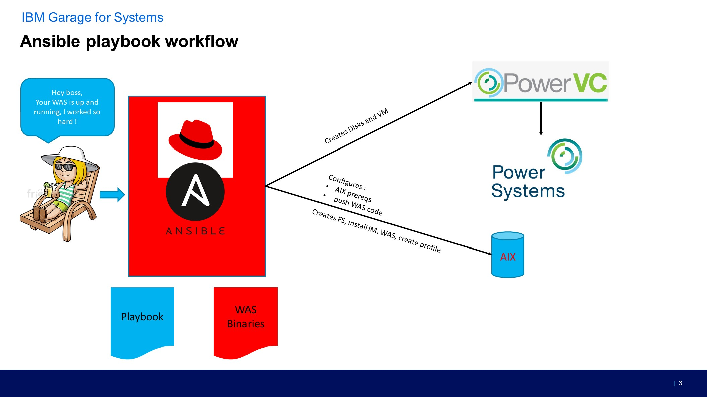

1.	Introduction 

This Lab in an introduction to Ansible for PowerVC / AIX .

In this lab, we will launch Ansible tasks from the control node running on Linux on Power, performing actions with Ansible and Openstack/PowerVC for creating a new AIX VM first. The VM will be visible on PowerVC. 

The second part of the lab is about automation on the AIX operating system: 
-	Modifying the root user characteristics
-	Setting filesystem size
-	Installing some prereq 
-	Installing Websphere Application Server

1.1.	Objectives 
The objectives of this lab are : 

•	Deploy an AIX  partition,  
•	Perfom operation on filesystems 
•	Install and configure Websphere Application server

Below is an architecture diagram describing the environment:  
  
  


2. Installing ansible openstack python modules

For ansible to be able to interact with PowerVC, you need to install openstacksdk.

Run this command to do so :

> pip3 install --user "openstacksdk==0.51.0" "python-openstackclient==5.4.0" dnspython dig

2.1. Create the openstack configuration file in your home directory

> vi clouds.yaml


``` yaml
clouds: 
   youcloudname: 
     auth: 
       auth_url: https://PowerVCIPaddress:5000/v3/ 
       domain_name: Default 
       username: YourUser 
       password: YourPassword 
       project_name: MyProject  
     verify: false
```
